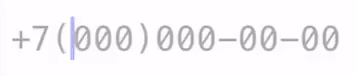
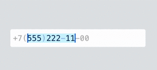
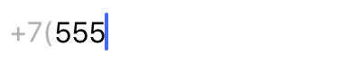
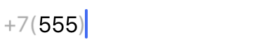
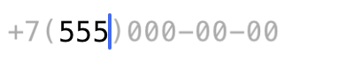

# FormattableTextView




## Description
FormattableTextView is a framework which allows you to format user input according to your mask. There are 2 implementations: for UITextView and for UITextField. UITextField is less memory consuming, UITextView is more flexible for customization. You can choose either one.

When you select the text in this field, only your input text is selected because non-input symbols are drawn in other layers. 



This approach allows to:
* prohibit user from putting the cursor in non-input symbols ranges
* avoid problems when adding/removing symbols inside existing text
* customize input and non-input attributes separately.

## Requirements
* iOS 8.0+

## Installation

### CocoaPods
```
pod 'FormattableTextView', :git => 'https://github.com/qiwi/FormattableTextView'
```

### Carthage
```
git "https://github.com/qiwi/FormattableTextView" "master"
```

## Usage

### Example
```swift
let field = FormattableTextField()
field.formatSymbols = ["d": CharacterSet.decimalDigits,
					   "w": CharacterSet.lowercaseLetters]
field.format = "dd.dd.dddd"
field.maskAppearance = .leftOnly
field.inputAttributes = [NSAttributedString.Key.font: UIFont.systemFont(ofSize: 16)]
field.maskAttributes = [NSAttributedString.Key.font: UIFont.systemFont(ofSize: 16),
						NSAttributedString.Key.foregroundColor: UIColor.lightGray]

```

### Usage notes

Set the mask with `format` property. By default `d` means digits, `w` means letters and `*` means any symbol. 

Examples:
* `+7(ddd)ddd-dd-dd` - phone number format for Russia
* `dd.dd.dddd` - date format
* `www*d dd` - 3 letters, any symbol, digit and 2 other digits after non-input space

You can set your own custom mapping using `formatSymbols` property. All other symbols will be considered as non-input.

Non-input symbols have 3 appearance options:
* `leftOnly`
You will see only those non-input symbols which are located to the left of your inputted symbols


* `leftAndRight`
You will see only those non-input symbols which are located to the left and to the right of your inputted symbols


* `whole`
You will see all non-input symbols and placeholders for input symbols. Every key in `placeholders` parameter must exist among the `formatSymbols` keys. In this mode `inputAttributes` and `maskAttributes` properties have to be the same. Your font must be monospaced.


If you need to set input text programmatically use `text` property.

For left inset use `insetX` property.

You can modify input and non-input symbols appearance by using `inputAttributes` and `maskAttributes` properties.

## License
Distributed under the MIT License.

## Author
Mikhail Motyzhenkov

E-mail: m.motyzhenkov@gmail.com

Telegram: @motyzhenkovmd
